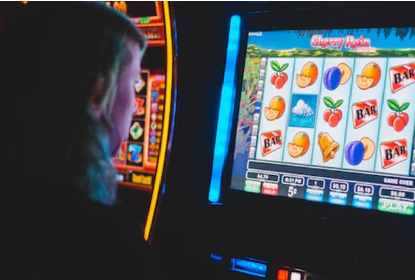
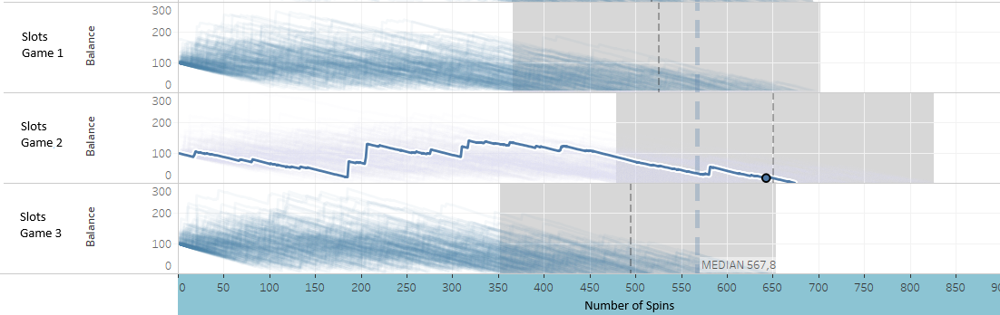
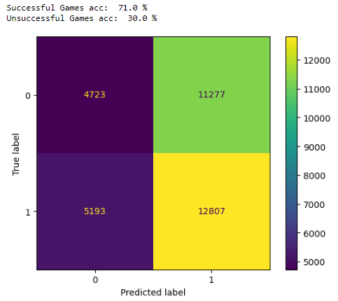
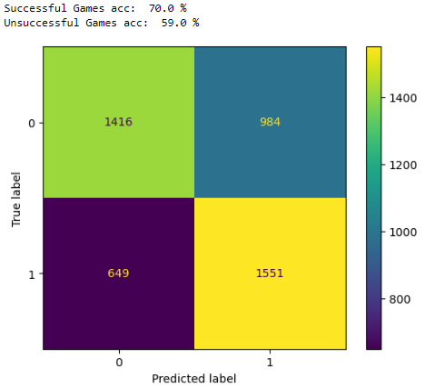
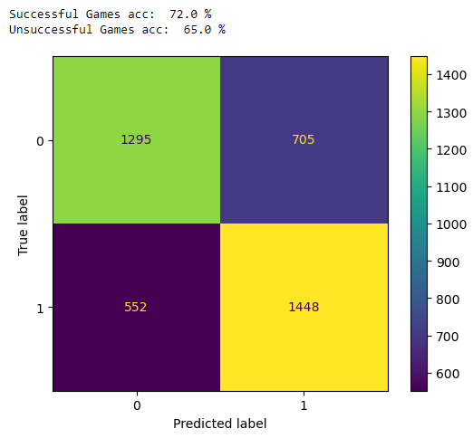

# Slots Games' Success Predictor
This project was built to satisfy the need of a real-life company which is dedicated to developing games for online casinos. This was also my thesis project for my master's in Artificial Intelligence and Deep Learning of the University of Alcala de Henares (Spain). The problem of this project was approached using different models, including:

* Feed Forward Neural Network
* Sequential Models:
  * Recurrent Neural Network (LSTM)
  * Convolutional Nerual Network (1 Dimensional Convolutions)


# 1 - Problem Overview

The company required a model that predicted if a newly designed Slots Game is going to be successful or not (binary output). The model would make its predictions based on the way that the game rewards their players after certain time of playing it. In other words, the model should tell if the game will influence their players to continue playing or not, by the way it provides rewards to them in a certain number of spins.

The objective is to verify if there is any pattern, in the reward systems of Slots Games, that would make them successful or un-successful, and to design a model that could indentify this pattern and predict it.



*figure 1.*

To train the model we used the results of thousands of spins during different game sessions of both, successful and unsuccessful,  Slots Games. Be aware, that the level of success or failure of an entertainment product such as a video game, is determined by the preference of its audience, and how much time they spent playing it. This was the measure we used to rank the Slots Games whose data was used to train the model.

I built two models to tackle this issue, one where it was merely analyzed the 'net wins' or 'pay outs' that a player had in a n-spins game session. And another, where it was analyzed different aspects relating to the rewards of the game, such as the payout amounts, the number of free spins won, the length of continuous winning and lossing streaks, the frequency of 'near-miss' and 'losses disguised as wins' events, and so on, also within a n-spins game session.


# 2 - Solution Approach

## 2.1 - Sequential Models (Recurrent and Convolutional)
As mentioned, the issue was tackled from different angles. One of them being the analyzing of the game pay outs during a game session of n-spins. A pay out is simply the amount of money a player won in a single spin, e.g., a player bet $1 and won $0.5 in one spin. 

From the pay outs of each spin in a player's game session, we could form a sequence of pay outs, that can be fed into a sequential neural network. However, we can also use a sequence of the value of the player's balance after each spin, as the balance is directly affected by the pay outs the player received and it better draws the trajectory of the results obtained by the player. We can easily see how the player's balance increases or decreases according to the pay outs received from the start to the end of the game session.



*figure 2.*

The above image shows a graph of the balance's trajectory of different players in different game sessions for a corresponding Slots Game (precisely 1000 game sessions per Slots Game). We can see that all of the players' balance start at $100 and they follow certain path until they reach $0 after a certain number of spins.

The idea is to feed the sequences into a neural network and tell the model which of those sequences belong to a successful or unsuccessful game, so that the model can learn to classify them correctly.

### 2.1.1 - Model Structure
As mentioned, for this sequence data I built 2 different models a Recurrent Neural Network, using Long-Short-Term Memory layers, and a Convolutional Neural Network, using convolutional layers of 1 Dimension.

For both models we tested different activation, optimizer and loss functions, however the best results were achieved using:
* **Rectified Linear Unit (ReLU)** as activation function for the hidden layers
* **Sigmoid** as the activation function in the output layer
* **Stochastic Gradient Descent (SGD)** as the optimizer
* **Binary Cross-Entropy** as the loss function.

The models were kept simple (just a few layers), to avoid overfitting problems due to a high complexity.

Recurrent NN structure:
```python 
def recurrent_model(inputShape,learningRate):
    model=Sequential()
    model.add(Bidirectional(LSTM(64,return_sequences=True,activation='relu'), input_shape=(inputShape,1)))     
    model.add(Bidirectional(LSTM(24,activation='relu',return_sequences=True)))
    model.add(Bidirectional(LSTM(5,activation='relu')))

    model.add(Dropout(0.2))
    model.add(Dense(64, activation='relu'))
    model.add(Dense(32, activation='relu'))
    model.add(Dense(1, activation='sigmoid'))
    
    opt = keras.optimizers.SGD(learning_rate=learningRate)
    model.compile(loss='binary_crossentropy', optimizer=opt,metrics=['accuracy'])
    
    return model
 
```
Convolutional NN structure:
```python 
def cnn_model (inputShape,learningRate):
    model = Sequential()

    model.add(Conv1D(filters=254, kernel_size=128,  activation='relu',input_shape=(inputShape,1)))
    model.add(MaxPooling1D(pool_size=2))
    
    model.add(Dropout(0.4))

    model.add(Conv1D(filters=128, kernel_size=35, activation='relu'))
    model.add(MaxPooling1D(2))


    model.add(Flatten())
    model.add(Dense(128, activation='relu'))
    model.add(Dense(64, activation='relu'))
    model.add(Dense(1, activation='sigmoid'))
    opt = keras.optimizers.SGD(learning_rate=learningRate)
    model.compile(loss='binary_crossentropy', optimizer=opt, metrics=['accuracy'])

    return model
```

### 2.1.2 - Results Obtained

From both models the one that returned better results was the convolutional model using a learning rate of 0.001. However, it didn't make good predictions at first, I needed to remove noisy training data to get more decent results in a second attempt.

The cnn model was first trained with 1000 sequences per Slots Game (corresponding to the 1000 game session per game). However, from these 1000 game sessions there are several that introduce a great amount of noise due to the inherent volatility and randomness of Slots Games. As we can see in the confusion matrix below the first convolutional model was unable to generalize properly:



*figure 3.*

We can appreciate how the predictions of the model were 70% true positives (successful category) and only 30% true negatives (unsuccessful category), which means that the model is only able to classify one particular category, 'successful'.

To try to mitigate the noise problem brought by the outlier sequences, I trained the model a second time, but now with the game sessions that were closer to the 'median sequence'. At figure 2, we can appreciate how the players' balance start at $100 and end at $0 after certain number of spins, for each of the game sessions the number of spins in which the game session ended is different, thus creating a range of 'final spins' for each of the Slots Games (The gray block for each game in figure 2). 

I used then, the sequences that ended in the third quantile of this range (from the 40th to the 60th percentiles), which are the ones closer to the median, to train our model one more time.



*figure 4.*

In this second attempt, we can see that the performance of the model improved greatly, although is still far from a high accuracy. The model's prediction were 70% true positives and now almost 60% true negatives.

From these results we can conclude that there is indeed certain pattern in the way a successful Slots Game pays out to its players different than a unsuccessful one. However, the pay outs alone are probably not enough to predict if a Slots Game will be successful or not with a high accuracy. Specially due to the noise we would observe in a single Slots Game's game session.


## 2.2 - Feed Forward Neural Network

Given the results obtained analyzing the Slots Games' pay outs with the sequential models, I built a Feed Forward neural network that would analyze other aspects of the reward system of Slots Games to see if it would be able to make more accurate predictions.

The aspects of the reward systems that were included to train this model were the *spins pay out, the free games won, near-miss events, loses disguised as winnings, Losing and Winning Streaks, Distinct Pay Out, and Total Played Spins*. 

The information of theses variables was summarized into statistical distributions for each of the game sessions, so that the data would be fed easily into the model and also to try to reduce the existing noise. The statistics that were extracted for each of the variables are the *minimum, maximum, mean, standard deviation, median, mode, kurtosis, skewness, 25th percentile and 75th percentile*.


### Structure used
For this model we also tested different hyperparameters, however the ones that returned the best results were the ones listed below using a learning rate of 0.001:

* **Rectified Linear Unit (ReLU)** as activation function for the hidden layers
* **Sigmoid** as the activation function in the output layer
* **Adam** as the optimizer
* **Binary Cross-Entropy** as the loss function.


### Results Obtained

After training our model we tested it on new data from unseen Slots Games, the predictions returned were the following:



As we can appreciate, there has been an slightly improvement in the model's performance, which means there are other components in the Slots Games rewards that have an important impact in the way that the player will perceive the game. However, 
